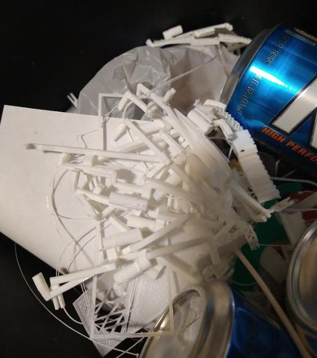

05/13/2023

1:35 PM (woke up late)

still working on this... shifting back the monocle so it's not farther away and rotating in Z direction to focus the text edges

Not sure by how much, very little I think 1 degree to the right (brings right edge closer to eye)

11:02 PM

I am still tweaking/printing... I see to be going backwards and forwards

The issue is when you raise the monocle up higher in your FOV, you have to tilt it away from you... whihc you'd think geometrically it should be the same right?

Anwyay the problem is I'm either seeing white text turn a little pink in certain areas or there's double edges on text... and blurrier

The fix for some of that is changing color and increasing font size... also not to read a wall of text like a prompter

See all the revisions

Each print started out about 20 some minutes, now they're between 39-41 minutes

I did design the magnetic connector but I have to finish it tomorrow once I settle on this glasses mount
