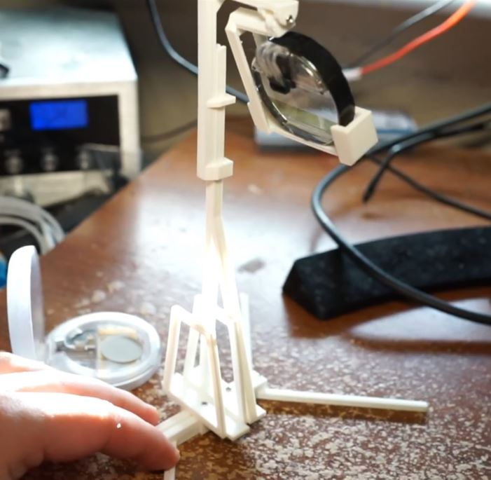

### Phone Recording Stand

The monocle is really hard to film IMO. It is best IMO to film it with your phone's macro feature.

So this is a stand that holds your phone upright/right against the monocle viewing area.

So you can record the monocle's display as you program it wirelessly via say the web repl.

Print times

- base 2hrs
- phone holder 40 mins
- hangar stand 1hr 47 mins
- monocle holder 1hr 9 mins
- video hangar 2 hrs (differnet height, vertically stacked cameras)

This stand was designed around 2020 Moto G Stylus

Using M1.7*6 screws
