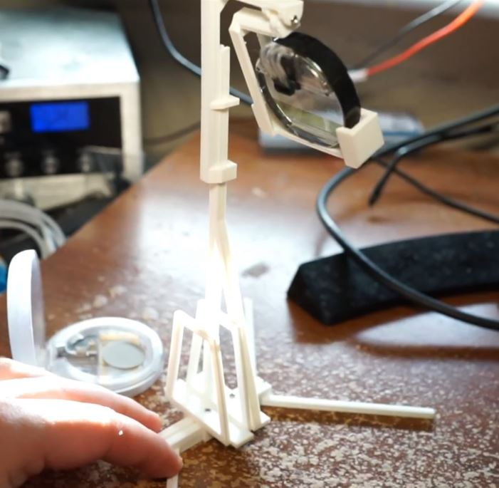
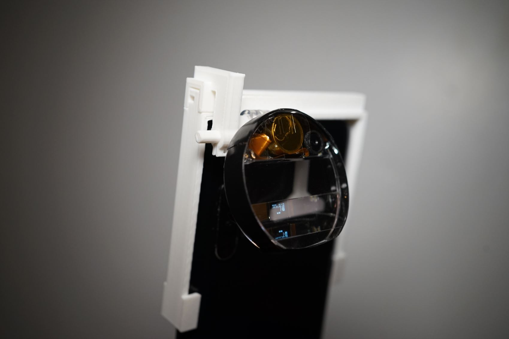
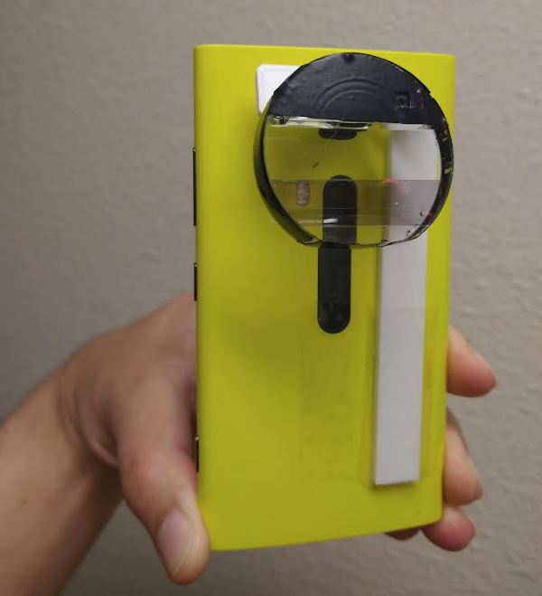

### Desk stand for recording with phone

This is designed to be dynamic for the most part (can fit different phones) with sliding adjustments

<a href="https://www.youtube.com/watch?v=oRKQFbEJR7w">View video (YouTube)</a>

### Hand held stand

While this is custom designed for this phone (and one for iPhone 14 pro max), the concept is the same for other phones.

The simple design below can be used as a base regarding the paddle/rotating mechanism.

<a href="https://www.youtube.com/watch?v=hVtDwkcApw0">View video (YouTube)</a>

### "Popsicle stick" stand

This one is the simplest/fastest to print. It's nice because it be used for pretty much any phone. You can see here that I temporarily taped it to the phone.
